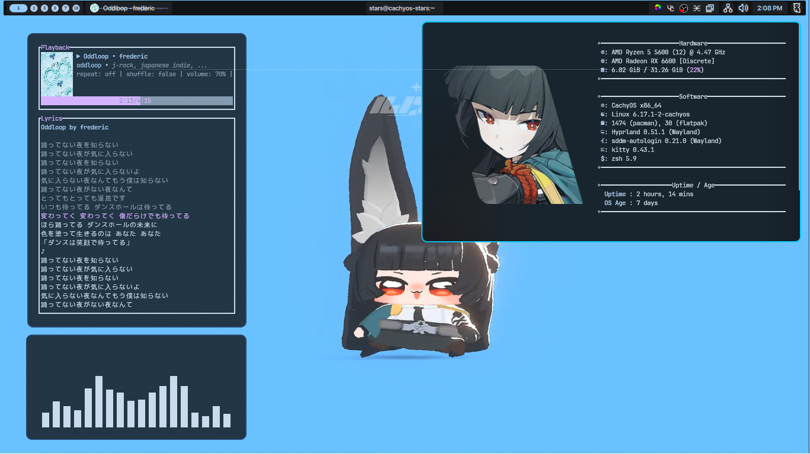

# My Scuffed Dotfiles

</img>

## Prerequisites
- Use CachyOS (Arch-based, Hyprland edition recommended).
- Zsh: `sudo pacman -S zsh`
- Oh My Zsh: `sh -c "$(curl -fsSL https://raw.githubusercontent.com/ohmyzsh/ohmyzsh/master/tools/install.sh)"` 
- Powerlevel10k zsh theme: `git clone --depth=1 https://github.com/romkatv/powerlevel10k.git "${ZSH_CUSTOM:-$HOME/.oh-my-zsh/custom}/themes/powerlevel10k"`
  - Open ~/.zshrc, find the line that sets ZSH_THEME, and change its value to "powerlevel10k/powerlevel10k".
- Noctalia-Shell: `https://docs.noctalia.dev/`
- Kitty: `sudo pacman -S kitty`
- Hyprland : `sudo pacman -S hyprland`
- Install Nerd Font (JetBrains): Copy from `.local/share/fonts/` or `https://github.com/ryanoasis/nerd-fonts/releases/download/v3.4.0/JetBrainsMono.zip`. and extract to your ~/.local/share/fonts/

## Installation
1. Clone this repo: `https://github.com/StarS2112/dotfiles.git`
2. Copy configs:
   ```bash
   cp -r dotfiles/.config ~/.config
   cp dotfiles/.zshrc ~/.zshrc
   cp dotfiles/.p10k.zsh ~/.p10k.zsh
   cp -r dotfiles/.local/share/fonts/* ~/.local/share/fonts/ 
3. You might need to clear your font cache if you copy the fonts : `fc-cache -fv`
